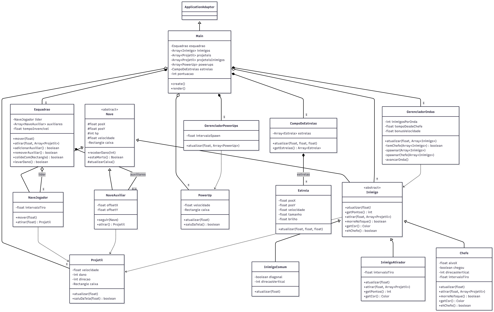

# Relatório Projeto

## Identificação
Cedric Marques Rocha - Sistemas de Informação

## Proposta

A proposta de projeto consiste em um jogo 2D do gênero shoot'em up de rolagem lateral, desenvolvido em Java com o framework libGDX. A escolha do gênero veio do tema obrigatório do trabalho, "grupo". O objetivo estabelecido foi fazer com que esse tema fizesse parte da jogabilidade, e não fosse só um detalhe. Por isso, em vez de o jogador controlar uma única nave, como na maioria dos jogos do tipo, a ideia central é que ele comande um esquadrão que vai crescendo ao longo da partida. O tema aparece, portanto, na mecânica principal: o jogador controla uma nave central e, ao longo do jogo, pode recrutar naves auxiliares que se posicionam em formação fixa ao seu redor, formando um esquadrão de até 5 naves que atiram em conjunto. Quanto maior o grupo, maior o dano do jogador. Ao ser atingido, o esquadrão perde uma nave auxiliar, e quando sobra apenas a líder sozinha o jogo termina.
A estrutura do jogo é de rolagem lateral: o esquadrão avança pela tela enquanto surgem inimigos em ondas, que vão ficando mais numerosos e mais rápidos com o tempo. Os inimigos têm padrões de ataque variados, alguns apenas avançam em direção ao jogador, outros disparam projéteis, e o chefe se movimenta em patrulha e atira em triplos.
Entre as funcionalidades estão presentes: movimentação da nave pelo teclado, coleta de power-ups que aumentam o esquadrão, inimigos que surgem com padrões de ataque variados, detecção de colisões entre projéteis e naves inimigas, um sistema de pontuação e um chefe ao final da fase. Além dessas, o projeto também ganhou telas de início e de fim de jogo, um fundo estelar com efeito de parallax e sprites em pixel art para dar mais identidade visual.

## Processo de desenvolvimento


## Diagrama de classes

Classes do jogo e as relações entre elas:




## Orientações para execução

### Pré-requisitos

- JDK 11 ou superior instalado.

### Jogar online

A versão web está publicada no itch.io: https://cedric2026.itch.io/jogo-nave

### Rodar no desktop

Na raiz do projeto, execute:

```
./gradlew lwjgl3:run
```

## Resultado final

Vídeo curto demonstrando uma partida (esquadrão crescendo, ondas de inimigos e o chefe):

[https://github.com/elc117/final-2026a-cedric_/raw/main/imagens/gameplay.mp4](https://github.com/user-attachments/assets/75cdbd99-75c6-4209-a92f-578a41797ffe
)

## Referências e créditos

- [libGDX](https://libgdx.com/) 1.14.1: framework do jogo (renderização, entrada, ciclo de vida). Projeto gerado a partir do template do [https://libgdx.com/wiki/start/project-generation](https://libgdx.com/wiki/start/project-generation).
- [gdx-ai](https://github.com/libgdx/gdx-ai) 1.8.2 e [gdx-controllers](https://github.com/libgdx/gdx-controllers) 2.2.4: dependências incluídas pelo template, mas não utilizadas no jogo.
- [documentação do libGDX](https://libgdx.com/wiki/): ciclo de vida, SpriteBatch, OrthographicCamera e carregamento de assets.
- Sprites das naves, inimigos e tiros foram gerados com chat gpt. Prompt utilizados: Crie um conjunto de sprites em pixel art para os seguintes objetos:Nave do jogador 40×15, Nave auxiliar 40×15, Inimigo comum 50×50, Inimigo atirador 50×50, Chefe 120×120 e Tiro do jogador 20×10.
- Diagramas de classes gerados com [Mermaid](https://mermaid.ai/).

